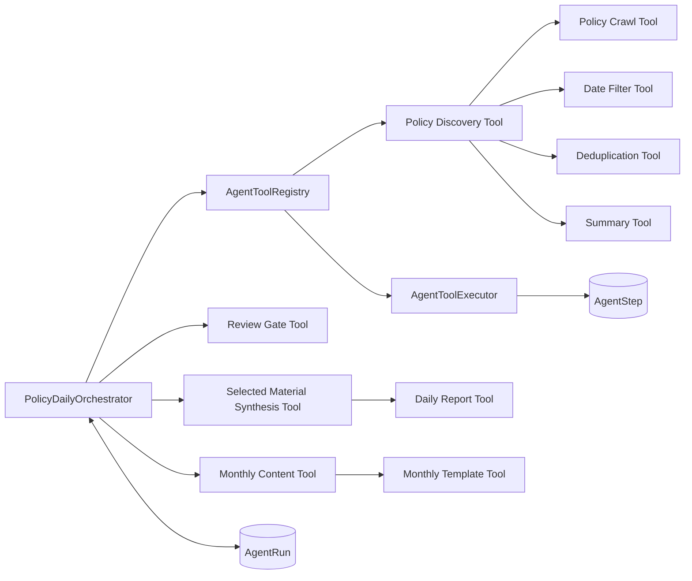

# Agent Architecture

## 设计目标

政策日报 Agent 使用确定性 Orchestrator 驱动主流程。大模型只用于政策摘要等语义任务，日期过滤、去重、审核门和 Word 生成保持程序化执行。



## Orchestrator

`PolicyDailyOrchestrator` 是流程的唯一协调入口：

1. 创建 `AgentRun`；
2. 通过 `AgentToolRegistry` 查找 Tool；
3. 通过 `AgentToolExecutor` 执行并记录 Tool；
4. 采集完成后进入 `WAITING_REVIEW`；
5. 人工勾选需要进入报告的政策素材后通过 Review Gate；
6. Agent 综合所选政策，生成综合研判和本期要点；
7. Word Tool 排版并进入 `COMPLETED`。

月报采用两阶段调用：Agent 先基于当前工作区内人工勾选通过的政策生成结构化栏目内容，再由确定性的模板 Tool 将内容写入原始 Word 模板。报告月份只作为月报元数据，不会把已勾选素材排除在外；模型不直接创建或排版 Word。

## Tool Calling

所有 Tool 实现统一的泛型接口：

```java
public interface AgentTool<I, O> {
    String name();
    String description();
    O execute(I input);
    ToolRetryPolicy retryPolicy();
}
```

当前注册的 Tool：

| Tool | 职责 | 默认尝试次数 |
| --- | --- | ---: |
| `policy.discover` | 发现并保存候选政策 | 1 |
| `policy.crawl` | 抓取单篇政策正文和证据 | 3 |
| `policy.date-filter` | 校验实际发布日期 | 1 |
| `policy.deduplicate` | URL 与正文哈希去重 | 1 |
| `policy.summarize` | 调用模型生成摘要 | 3 |
| `policy.review-gate` | 判断人工审核是否完成 | 1 |
| `report.synthesize-selected` | 综合人工勾选的政策正文与证据 | 3 |
| `report.generate-daily` | 将综合内容和来源证据生成 Word 日报 | 2 |
| `report.generate-monthly-content` | 从审核通过的政策证据生成结构化月报内容 | 3 |
| `report.fill-monthly-template` | 将结构化内容写入原始 Word 模板 | 1 |

## Memory And State

- `agent_run`：保存任务状态、当前阶段、输入快照、记忆快照和最后错误；
- `agent_step`：保存每次 Tool 调用、尝试次数、耗时、输入输出摘要和失败分类；
- `daily_task`：保存日报采集业务统计；
- `policy_document`：保存政策正文、来源证据和人工审核结果。

`AgentRun.memorySnapshot` 是可恢复的任务级 JSON 记忆，包含采集指标、审核计数和下一动作。

## Retry And Failure Isolation

`AgentToolExecutor` 根据 Tool 策略执行指数退避。网络超时、连接失败、HTTP 429 和 HTTP 5xx 被视为可重试错误；参数错误和确定性业务校验失败不会重试。

单篇政策失败由采集服务记录后继续处理其他候选项，因此不会导致整批日报任务失败。

## Agent API

| Method | Path | Description |
| --- | --- | --- |
| `GET` | `/api/agent/tools` | 查看 Tool 注册表 |
| `GET` | `/api/agent/runs/recent` | 查看最近 Agent 运行 |
| `GET` | `/api/agent/runs/{runId}` | 查看运行状态和 Tool 轨迹 |
| `GET` | `/api/agent/tasks/{taskId}` | 查看任务最近一次 Agent 运行 |
| `POST` | `/api/agent/tasks/{taskId}/resume` | 人工审核后恢复 Agent |
| `POST` | `/api/review/tasks/{taskId}/selection` | 批量保存进入报告的政策素材 |
| `DELETE` | `/api/tasks/{taskId}` | 删除工作区、政策和 Agent 轨迹 |
| POST | /api/reports/monthly/tasks/{taskId} | 使用当前任务已勾选素材生成原模板月报 |

原有采集与日报接口保持不变，并已在内部接入 Orchestrator。
